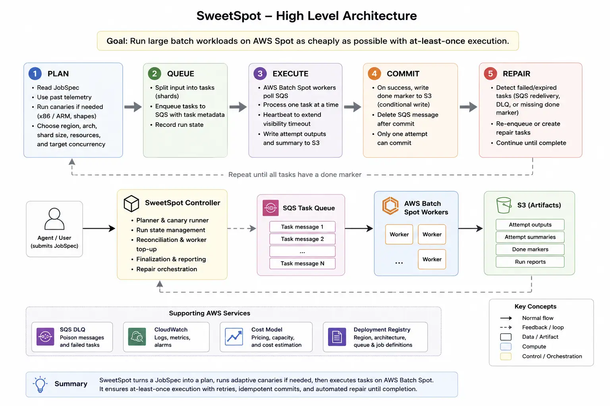
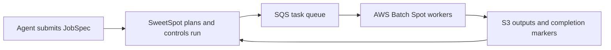
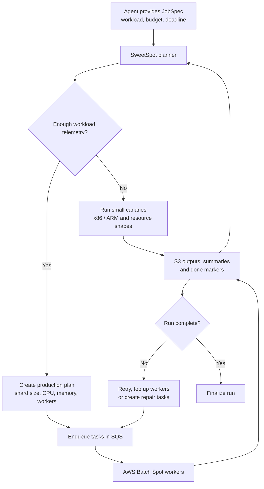

# SweetSpot

SweetSpot is a cost-aware AWS Batch Spot work runner for trusted, idempotent, embarrassingly parallel workloads.

Install the Python package and use the `sweetspot` CLI's primary controller workflow (`plan`, `run`, `status`, `repair`, `cancel`) for new workloads. Lower-level enqueueing, worker submission, finalization, diagnostics, Spot scouting, and lane management commands remain available as advanced/admin surfaces and are canonically grouped under `sweetspot admin ...` aliases; direct top-level forms remain for compatibility.

This project packages a reliability pattern for large retryable AWS Batch jobs:



```text
SQS task message
→ worker checks deterministic S3 done marker
→ if done exists: delete/ack message
→ else process task
→ upload output/summary
→ upload done marker last
→ only then delete/ack message
```

If a Spot host dies before ack, SQS visibility timeout returns the task. If a task repeatedly fails, SQS redrives it to the DLQ.

SweetSpot is an at-least-once runner, not an exactly-once transaction system. The SQS queue is a trusted control plane: anyone who can enqueue a task can choose the command executed by the worker task role. Commands must therefore be trusted and idempotent, or use `task_id` as their own idempotency key for external side effects. Do not expose the queue to untrusted producers.

## Architecture





## What it is

AWS-specific, OpenTofu-compatible framework for embarrassingly parallel jobs:

- batch inference / annotation
- dataset conversion
- web scraping
- simulation sweeps
- self-play generation
- CPU-heavy ETL

## What it is not

- not cloud agnostic
- not a scheduler replacing AWS Batch
- not tied to chess or any single project

Chess/Stockfish workflows live under `examples/`.

## Install for development

See `CONTRIBUTING.md` for contributor workflow, trust-boundary expectations, and release hygiene.

```bash
python -m venv .venv
. .venv/bin/activate
pip install --constraint requirements.lock -e .

# optional local closeout checks used by CI
pip install --constraint requirements-dev.lock -e '.[dev]'
ruff format --check .
ruff check .
mypy sweetspot
python -m unittest discover -s tests -v

# full local release closeout (also runs OpenTofu checks when tofu is installed)
scripts/verify_release.sh
```

## Minimal task schema

Each SQS message is a JSON object:

```json
{
  "schema": "sweetspot.task.v1",
  "run_id": "hello-001",
  "task_id": "task-000001",
  "command": ["python", "/app/hello_worker.py"],
  "timeout_seconds": 3600,
  "output_s3": "s3://my-bucket/runs/hello-001/shards/task-000001.txt",
  "summary_s3": "s3://my-bucket/runs/hello-001/summaries/task-000001.summary.json",
  "done_s3": "s3://my-bucket/runs/hello-001/done/task-000001.done.json"
}
```

The worker sets environment variables for the command:

```text
SWEETSPOT_TASK_JSON       path to local task JSON
SWEETSPOT_TASK_ID
SWEETSPOT_RUN_ID
SWEETSPOT_TASK_HASH       stable hash of the task fields committed by the worker
SWEETSPOT_ATTEMPT_ID      immutable execution attempt id
SWEETSPOT_OUTPUT_PATH     local path to write if output_s3 should be uploaded by framework
SWEETSPOT_METRICS_PATH    optional JSON metrics file written by the command for cost telemetry
SWEETSPOT_OUTPUT_S3       attempt-scoped S3 URI used by this execution
SWEETSPOT_SUMMARY_S3      attempt-scoped S3 URI used by this execution
SWEETSPOT_DONE_S3         canonical conditional done marker URI
SWEETSPOT_TASK_TIMEOUT_SECONDS default task timeout used by the worker (default: 39600 / 11h)
```

If `output_s3` is present, the command must create `SWEETSPOT_OUTPUT_PATH` before exiting successfully; otherwise the task is treated as failed and no done marker is written. Successful workers upload output, summaries, and stdout/stderr under attempt-scoped S3 paths, then publish the canonical done marker with a conditional `If-None-Match: *` write (412 means an existing marker won; transient 409 conditional conflicts are retried). If another duplicate attempt won first, the worker validates the winning marker before deleting the SQS message.

For v2 markers, `output_s3` in the task is the logical output URI used for task hashing; the actual immutable object URI is recorded in the done marker's `output.uri` and in finalizer outputs manifests.

Task payloads are validated as `sweetspot.task.v1` before execution: `run_id`, `task_id`, `command`, timeout, env, marker URIs, and S3 URI syntax must pass bounded checks. Task-provided `env` keys may not start with `SWEETSPOT_`, `AWS_`, or `ECS_`; those namespaces are reserved for the framework and runtime.

For production, set `SWEETSPOT_ALLOWED_S3_PREFIXES` or pass `--allowed-s3-prefix` to `sweetspot admin worker` / `sweetspot admin submit-workers` / `sweetspot admin supervise-workers`. When configured, every `s3://...` URI found in the task payload, including command arguments and derived done markers, must be under one of those prefixes. Exact-key equality to a non-root prefix is rejected so runtime validation matches the OpenTofu IAM policy's `${prefix}/*` object scope.

Legacy v1 done markers are not accepted by default because they do not bind the full task hash or immutable attempt output. Use `--allow-legacy-done-markers` / `SWEETSPOT_ALLOW_LEGACY_DONE_MARKERS=1` only for an explicit migration pass, including `sweetspot admin finalize --allow-legacy-done-markers` for old runs.

Finalization is streaming and scale-oriented: `sweetspot admin finalize` reads task JSONL line-by-line, writes complete `task_status.jsonl`, `repair_tasks.jsonl`, and `outputs.jsonl` artifacts, and keeps only bounded samples in `final_manifest.json`. Use `--dry-run` to preview upload/READY targets while still writing local artifacts but skipping S3 uploads, READY deletion, and READY publishing. Use `--use-listing-index` or repeat `--preload-s3-prefix` for large runs to trade S3 LIST calls for fewer per-task HEAD requests.

Worker observability is on by default: child stdout/stderr are streamed to container logs for CloudWatch, a bounded redacted tail is stored in the task summary, and capped redacted attempt logs are uploaded to S3. Use `--log-tail-bytes`, `--max-log-bytes`, and repeatable `--redact-regex` on `sweetspot admin worker`, `sweetspot admin submit-workers`, or `sweetspot admin supervise-workers` for sensitive workloads. Redaction is applied per newline-terminated log record; overlong unterminated records are suppressed with a placeholder rather than risk leaking a partial secret.

For measured cost optimization, tasks may write a JSON object to `SWEETSPOT_METRICS_PATH`, for example `{"completed_units": 100000, "useful_compute_seconds": 3600, "input_bytes": 1048576, "output_bytes": 524288}`. The worker includes this under `summary.telemetry` together with instance/architecture/Region/AZ/image best-effort metadata, SQS receive count/retry status, startup delay from SQS sent timestamp, bytes transferred, interruption/failure status, and discarded compute seconds. `sweetspot admin scout --observed-summaries ...` and the standalone compatibility command `sweetspot-scout --observed-summaries ...` consume these summaries to rank pools by expected total cost, not only Spot price.

Task timeouts are capped below SQS's 12-hour visibility ceiling. Prefer much shorter shards, and checkpoint/split work that cannot fit safely under the default 11-hour cap.

## Sizing and repair safety

SweetSpot works best when each task is small, trusted, and idempotent. Do **not** launch huge uncheckpointed tasks on Spot just because your input files are large. First run a representative canary, estimate throughput, then choose a chunk size whose predicted per-task runtime is comfortably below your timeout and cheap to replay after interruption.

An advanced manual production loop is:

1. derive and run a canary;
2. estimate runtime/cost from canary telemetry with `sweetspot admin estimate-runtime`;
3. enqueue and submit in one command with `sweetspot admin enqueue-and-submit --wait-for-visible-seconds ...` to avoid SQS approximate-depth races;
4. finalize to produce `task_status.jsonl` and `repair_tasks.jsonl`;
5. build repairs with `sweetspot admin repair-plan`, excluding tasks already owned by active workers;
6. dry-run guarded `sweetspot admin cancel-jobs` before stopping any matching Batch jobs;
7. dry-run then apply `sweetspot admin cleanup-stale-messages` for visible duplicate messages whose done markers already exist.

For Spot, prefer many short tasks over a few long tasks. If a task cannot checkpoint or finish quickly, use an On-Demand repair lane or split it further.

## Agent-facing direction

The normal agent workflow is `sweetspot plan -> sweetspot run -> sweetspot status -> sweetspot repair/cancel`. Lower-level commands expose SweetSpot's operator phases; they remain useful for advanced debugging, migration, and manual recovery, but they are not the default agent contract. Prefer the `sweetspot admin ...` aliases (for example, `sweetspot admin enqueue-jsonl` or `sweetspot admin finalize`) when intentionally using those lower-level surfaces. In the primary workflow, agents provide workload intent, budget, deadline, and output locations while SweetSpot chooses shard size, resource shape, architecture, and parallelism.

Until the full controller is complete, treat direct sizing flags such as worker count, vCPU, memory, task timeout, shard size, and messages per worker as advanced controls that require canary evidence and dry-run review. Adaptive helpers now consume canary summaries internally so the controller can grow from tiny replay-safe canaries instead of asking agents to invent chunk sizes. `sweetspot plan --input-manifest-jsonl manifest.jsonl --out-canary-tasks-jsonl artifacts/canary_tasks.jsonl` materializes controller-owned canary tasks without mutating AWS; those canaries cover the built-in 1/2/4 vCPU resource lattice and, when `arm64` is allowed in the JobSpec, paired x86/ARM candidates. `sweetspot run JOB_SPEC --input-manifest-jsonl manifest.jsonl --artifact-dir artifacts/run --deployment deployment.json --apply` can now launch those canaries only when the deployment registry declares isolated `canary_routes` for every candidate shape; otherwise canary apply fails closed instead of mixing candidates on a shared queue. After those workers finish, rerun with `--collect-canary-summaries` to gather each canary task's S3 summary into `canary_summaries.jsonl` and write `production_plan.json`/`production_tasks.jsonl` when calibration is ready. If measured canaries are still below the target replay-safe duration, the next plan emits a larger canary generation rather than production tasks. Once summaries are calibrated, `sweetspot plan --canary-summary-jsonl summaries.jsonl --input-manifest-jsonl manifest.jsonl` exposes the measured shard-sizing decision, resource/architecture selection, and production shard count in JSON. Add `--out-production-tasks-jsonl artifacts/tasks.jsonl` to explicitly materialize calibrated `sweetspot.task.v1` production shards as a local artifact for review/enqueue. Calibrated `sweetspot run JOB_SPEC --apply` performs a guarded kickoff/resume step when production tasks, `--artifact-dir`, and `--deployment deployment.json` are supplied. Legacy queue/job flags remain compatibility fallbacks for operator debugging, but the primary agent path is `--deployment` because it binds the Plan-selected region/architecture to digest-pinned images, revision-pinned job definitions, isolated canary routes, and verified S3 manifest identity. It writes `run_state.json`, enqueues production tasks once, submits a Plan-sized run-scoped Batch worker wave, and performs bounded reconciliation rounds; queue-depth backlog accounting requires a dedicated queue so shared-queue messages are never mistaken for this run's backlog. Add `--dedicated-run-queue --create-run-queue` to create or verify a tagged controller-owned per-run SQS queue and bind workers to that run-owned URL before enqueue. Dedicated-queue top-up workers are durably recorded before each Batch submit mutation; shared queues remain conservative/observational. For a dedicated production queue, add `--reconcile-until-drained --reconcile-rounds N --reconcile-interval-seconds S` to keep watching run-scoped queue depth and active workers until both drain or the round limit is reached. Reruns against the same artifact directory resume without re-enqueueing completed phases, and completed reconciliation can be extended by rerunning with a larger round limit. Add `--finalize` on a production apply/resume pass to run the streaming finalizer over the persisted `production_tasks.jsonl`, write `finalizer/` artifacts, and record the complete/incomplete result in `run_state.json`; S3 manifest upload and READY publication remain explicit via `--finalize-upload` and `--finalize-publish-ready`. `sweetspot status RUN_ID` is the simplified status entrypoint: it summarizes local run/finalizer/repair artifacts and, when AWS flags are supplied, scopes Batch workers to `RUN_ID` by default. `sweetspot repair RUN_ID` is the simplified repair entrypoint: it builds a run-scoped repair plan by default, and `--apply` can enqueue repair tasks after the JSON plan is reviewed. `sweetspot cancel RUN_ID` is the simplified cancellation entrypoint for run-scoped Batch job names; broader regex repair/cancellation remains available through the advanced `sweetspot admin repair-plan` and `sweetspot admin cancel-jobs` commands.

## Recommended cost optimization workflow

Cost optimization works best when it starts before the main run, not after workers are already launched:

1. Generate small, idempotent task shards that are cheap to replay after Spot interruption.
2. Run a representative canary on the same worker image and command you plan to use in production.
3. Have the task command write `SWEETSPOT_METRICS_PATH` with `completed_units`, `useful_compute_seconds`, and input/output byte counts.
4. Estimate task size and timeout safety with `sweetspot admin estimate-runtime`.
5. Run `sweetspot admin scout --preset mixed --observed-summaries ...` to compare x86 and ARM/Graviton pools by expected total cost, including replay, startup overhead, placement score, and non-compute costs.
6. Treat ARM as opt-in: Graviton can be materially cheaper, but only use ARM lanes after a canary proves the workload, dependencies, and container image are ARM-compatible. Keep x86 as the safe default when compatibility is unknown.
7. Feed the selected `expected_total_cost_per_1m_units` values into `sweetspot admin lane-manager`; it allocates cost-annotated eligible lanes cheapest-first and can keep an On-Demand repair lane for tail work.

Do not mix x86 and ARM instance types in one Batch queue unless the job image is verified multi-arch and every native dependency works on both architectures. Otherwise, use separate x86 and ARM queues/job definitions and model them as separate lanes.

## CLI quickstart

```bash
# enqueue JSONL task messages
sweetspot admin enqueue-jsonl \
  --queue-url https://sqs.REGION.amazonaws.com/ACCOUNT/my-work-queue \
  --tasks-jsonl examples/hello_world/tasks.jsonl \
  --artifact-dir artifacts/hello-001 \
  --allowed-s3-prefix s3://my-bucket/runs/hello-001 \
  --submit

# derive a deterministic canary subset before large launches
sweetspot admin derive-canary \
  --tasks-jsonl artifacts/hello-001/tasks.jsonl \
  --out-dir artifacts/hello-001/canary \
  --task-count 4 \
  --include-dlq-probe \
  --dlq-probe-prefix s3://my-bucket/runs/hello-001/dlq-probes

# submit AWS Batch workers, dry-run by default
sweetspot admin submit-workers \
  --sqs-queue-url https://sqs.REGION.amazonaws.com/ACCOUNT/my-work-queue \
  --batch-job-queue my-batch-spot-queue \
  --job-definition my-worker-jobdef:1 \
  --job-name-prefix hello-001-worker \
  --messages-per-worker 4 \
  --max-workers 64 \
  --allowed-s3-prefix s3://my-bucket/runs/hello-001 \
  --subtract-active

# add --submit after reviewing the dry-run

# enqueue and submit in one step, waiting for SQS's approximate visible count
# to catch up before sizing the worker wave
sweetspot admin enqueue-and-submit \
  --queue-url https://sqs.REGION.amazonaws.com/ACCOUNT/my-work-queue \
  --tasks-jsonl artifacts/hello-001/tasks.jsonl \
  --artifact-dir artifacts/hello-001/enqueue-submit \
  --batch-job-queue my-batch-spot-queue \
  --job-definition my-worker-jobdef:1 \
  --job-name-prefix hello-001-worker \
  --messages-per-worker 4 \
  --max-workers 64 \
  --wait-for-visible-seconds 60 \
  --allowed-s3-prefix s3://my-bucket/runs/hello-001

# add --submit after reviewing the dry-run

# estimate full-run wall time/cost from canary or task summary telemetry
sweetspot admin estimate-runtime \
  --sample-jsonl artifacts/hello-001/canary_summaries.jsonl \
  --task-count 1000 \
  --units-per-task 25000 \
  --active-workers 64 \
  --vcpus-per-worker 2 \
  --price-per-vcpu-hour 0.02 \
  --task-timeout-seconds 3600 \
  --spot

# keep a bounded worker pool topped up across one or more loops
sweetspot admin supervise-workers \
  --sqs-queue-url https://sqs.REGION.amazonaws.com/ACCOUNT/my-work-queue \
  --batch-job-queue my-batch-spot-queue \
  --job-definition my-worker-jobdef:1 \
  --job-name-prefix hello-001-worker \
  --target-active-workers 64 \
  --max-active-workers 64 \
  --max-submit-per-loop 16

# add --submit after reviewing the dry-run

# optional: put repeated defaults in JSON and pass --config (or SWEETSPOT_CONFIG)
cat > sweetspot.json <<'JSON'
{
  "defaults": {
    "profile": "prod",
    "region": "us-west-2",
    "queue_url": "https://sqs.REGION.amazonaws.com/ACCOUNT/my-work-queue"
  },
  "submit-workers": {
    "batch_job_queue": "my-batch-spot-queue",
    "job_definition": "my-worker-jobdef:1",
    "messages_per_worker": 4
  }
}
JSON
sweetspot --config sweetspot.json admin submit-workers --job-name-prefix hello-001-worker

# run-centric overview; JSON remains the default, table is opt-in
sweetspot status hello-001 \
  --artifact-dir artifacts/hello-001 \
  --queue-url https://sqs.REGION.amazonaws.com/ACCOUNT/my-work-queue \
  --job-queue my-batch-spot-queue \
  --format table

# advanced operator overview without a RUN_ID is still available
sweetspot status \
  --queue-url https://sqs.REGION.amazonaws.com/ACCOUNT/my-work-queue \
  --job-queue my-batch-spot-queue \
  --job-name-prefix hello-001-worker \
  --format table

# preflight AWS/SQS/S3/Batch/CloudWatch permissions and configuration
sweetspot admin doctor \
  --queue-url https://sqs.REGION.amazonaws.com/ACCOUNT/my-work-queue \
  --dlq-url https://sqs.REGION.amazonaws.com/ACCOUNT/my-dlq \
  --job-queue my-batch-spot-queue \
  --job-definition my-worker-jobdef:1 \
  --s3-prefix s3://my-bucket/runs/hello-001 \
  --validate-batch-metrics

# finalize by streaming tasks, checking S3 done markers, and writing manifests
sweetspot admin finalize \
  --run-id hello-001 \
  --output-prefix s3://my-bucket/runs/hello-001 \
  --tasks-jsonl artifacts/hello-001/tasks.jsonl \
  --workers 32 \
  --use-listing-index \
  --write-repair-jsonl artifacts/hello-001/repair_tasks.jsonl \
  --require-complete

# preview upload/READY targets without mutating S3
sweetspot admin finalize \
  --run-id hello-001 \
  --output-prefix s3://my-bucket/runs/hello-001 \
  --tasks-jsonl artifacts/hello-001/tasks.jsonl \
  --upload \
  --publish-ready \
  --dry-run \
  --require-complete

# optionally upload final_manifest.json and publish READY only when complete
sweetspot admin finalize \
  --run-id hello-001 \
  --output-prefix s3://my-bucket/runs/hello-001 \
  --tasks-jsonl artifacts/hello-001/tasks.jsonl \
  --upload \
  --publish-ready \
  --require-complete

# build a run-scoped repair JSONL while excluding missing tasks currently owned by active jobs
sweetspot repair hello-001 \
  --tasks-jsonl artifacts/hello-001/tasks.jsonl \
  --task-status-jsonl artifacts/hello-001/finalizer/task_status.jsonl \
  --out-jsonl artifacts/hello-001/repair_safe.jsonl \
  --job-queue my-batch-spot-queue

# after reviewing the JSON plan, enqueue repair tasks; add --submit-workers only when worker target flags are configured
sweetspot repair hello-001 \
  --tasks-jsonl artifacts/hello-001/tasks.jsonl \
  --task-status-jsonl artifacts/hello-001/finalizer/task_status.jsonl \
  --out-jsonl artifacts/hello-001/repair_safe.jsonl \
  --job-queue my-batch-spot-queue \
  --sqs-queue-url https://sqs.REGION.amazonaws.com/ACCOUNT/my-work-queue \
  --apply

# advanced broad-regex repair planning remains available when you intentionally need it
sweetspot admin repair-plan \
  --tasks-jsonl artifacts/hello-001/tasks.jsonl \
  --task-status-jsonl artifacts/hello-001/finalizer/task_status.jsonl \
  --out-jsonl artifacts/hello-001/repair_safe.jsonl \
  --job-queue my-batch-spot-queue \
  --job-name-regex hello-001-worker

# dry-run matching Batch job cancellation; add --apply only after reviewing the JSON report
sweetspot admin cancel-jobs \
  --job-queue my-batch-spot-queue \
  --job-name-regex '^hello-001-worker' \
  --status RUNNABLE \
  --status PENDING

# dry-run stale duplicate cleanup; add --apply only after reviewing counts/examples
sweetspot admin cleanup-stale-messages \
  --queue-url https://sqs.REGION.amazonaws.com/ACCOUNT/my-work-queue \
  --run-id hello-001 \
  --max-messages 100

# inspect AWS Batch jobs and logs; JSON remains the default, table is opt-in
sweetspot admin jobs --job-queue my-batch-spot-queue --status RUNNING --name-regex hello-001 --format table
sweetspot admin describe-job --job-id AWS_BATCH_JOB_ID --format table
sweetspot admin logs --job-id AWS_BATCH_JOB_ID --max-events 500 --last 50 --filter-regex 'progress|ERROR' --format table
# If --job-id is provided and --log-group is omitted, sweetspot uses the job's awslogs-group when AWS Batch reports it.
sweetspot admin watch-job --job-id AWS_BATCH_JOB_ID --max-seconds 3600 --format table

# dry-run a guarded S3 prefix cleanup; add --delete and exact --confirm-prefix to mutate.
# Add --include-versions for versioned buckets so old versions and delete markers are included.
sweetspot admin s3-delete-prefix \
  --prefix s3://my-bucket/runs/old-run/ \
  --include-versions \
  --artifact-dir artifacts/old-run/delete-dryrun

# inspect DLQ; filtered manual redrive is available for small repairs
sweetspot admin dlq \
  --dlq-url https://sqs.REGION.amazonaws.com/ACCOUNT/my-dlq \
  --run-id hello-001 \
  --format table

# whole-DLQ redrive should use native SQS StartMessageMoveTask where possible
sweetspot admin dlq \
  --dlq-url https://sqs.REGION.amazonaws.com/ACCOUNT/my-dlq \
  --queue-url https://sqs.REGION.amazonaws.com/ACCOUNT/my-work-queue \
  --native-redrive \
  --apply

# read-only Spot scout (also available as standalone sweetspot-scout)
# Emits JSON to stdout by default; add --format table for human-readable output.
# Use --preset mixed to surface ARM/Graviton savings; deploy ARM only after a canary proves compatibility.
sweetspot admin scout \
  --preset mixed \
  --regions us-west-2 us-east-2 eu-north-1 \
  --target-vcpus 256 512 \
  --bucket my-data-bucket \
  --observed-summaries artifacts/hello-001/summaries \
  --startup-overhead-seconds 90 \
  --cross-region-gb-per-1m-units 2 \
  --nat-gb-per-1m-units 0 \
  --json-out artifacts/hello-001/scout.json

# multi-lane dry-run submitter; lanes with expected_total_cost_per_1m_units are allocated cheapest-first among eligible placement scores
# If min_placement_score is set and AWS cannot return a score, the lane is ineligible unless allow_unknown_placement_score=true.
# For mixed architecture configs, set per-lane instance_types and use architecture-specific Batch queues/job definitions.
sweetspot admin lane-manager --config lanes.json
```

## OpenTofu

`infra/opentofu/` creates:

- SQS work queue + DLQ with SSE enabled, longer DLQ retention, and a by-source-queue redrive allow policy
- AWS Batch Spot compute environment and queue
- optional On-Demand repair queue
- least-privilege IAM roles scoped to the work queue and configured S3 bucket/prefixes
- a no-ingress Batch security group by default, plus an IMDSv2-required encrypted-root launch template
- generic worker job definition with runtime S3-prefix validation
- CloudWatch dashboard and baseline alarms for queue age, DLQ depth, Batch failures, and runnable-job stalls
- optional monthly AWS Budget alerts

Runtime and dev dependency lock files (`requirements.lock`, `requirements-dev.lock`) pin the Python dependency graph used by Docker and CI. The worker Dockerfile pins its Python base image by digest and drops to an unprivileged `sweetspot` user. CI runs unit tests, Ruff formatting/linting, typing, OpenTofu lock/fmt/validate checks, and a container build with SBOM/provenance attestations plus Trivy scanning.

See `infra/opentofu/README.md`.

## Cost case studies and release hygiene

- `docs/cost_model.md` explains worker telemetry, expected-total-cost pool ranking, and cost-aware lane allocation.
- `examples/run_manifest.example.json` is the machine-readable shape for anonymized run/cost evidence.
- `examples/lanes.mixed-arch.example.json` shows separate x86 and ARM/Graviton lanes with per-lane placement-score instance lists.
- `docs/case_study_template.md` is the companion prose template for public Spot vs On-Demand comparisons when Cost Explorer data is unavailable or private.
- `docs/case_studies/tiny_leela_sf18.md` records the real Tiny Leela Stockfish 18 labeling run that motivated Plan-authoritative apply, deployment identity binding, reconciliation, and controller-owned canaries.
- `scripts/verify_release.sh` runs the local closeout checks that mirror CI-critical gates.
- `docs/release_checklist.md` covers branch protection, action pin updates, and release/tag hygiene.
- `SECURITY.md` documents the trusted-workload threat model and reporting process.
- `CHANGELOG.md` tracks unreleased production-hardening changes.

## License

Apache-2.0.
