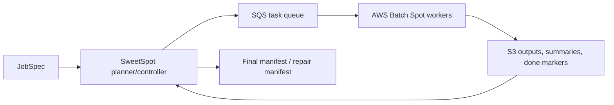

# SweetSpot

SweetSpot runs millions of trusted, idempotent tasks on AWS Batch Spot as cheaply as possible, with SQS retries, S3 done markers, repair manifests, and cost-aware lane selection.

It is **not** a general ETL orchestrator. SweetSpot is the low-level execution harness you reach for when the work is already a large set of independent commands and the hard part is making a cheap Spot run durable, observable, and recoverable.

## The problem

You have a huge batch job:

- annotate 10M chess positions,
- run batch inference,
- generate self-play games,
- convert a dataset,
- run simulation sweeps,
- scrape or enrich many independent records,
- or process CPU-heavy rows where each unit can be retried safely.

Raw AWS Batch gives you containers and scheduling, but you still have to build task fanout, retry semantics, completion ledgers, repair manifests, finalization, and cost-aware lane choices. Airflow, Dagster, Prefect, Glue, Ray, Dask, and Step Functions are useful tools, but they are not specialized for cheap, homogeneous, at-least-once AWS Batch Spot fanout.

SweetSpot fills that gap.

## What SweetSpot does

SweetSpot packages a boring durable protocol:

```text
SQS task message
-> worker checks deterministic S3 done marker
-> if done exists: delete/ack message
-> else process task
-> upload output/summary
-> upload done marker last
-> only then delete/ack message
```

If a Spot host dies before ack, SQS visibility timeout returns the task. If a task repeatedly fails, SQS redrives it to the DLQ. Finalization walks the task list and S3 done markers to build durable manifests and repair plans.

SweetSpot is **at-least-once**, not exactly-once. The SQS queue is a trusted control plane: anyone who can enqueue a task can choose the command executed by the worker task role. Commands must therefore be trusted and idempotent.

## Five nouns to learn

- **JobSpec**: the run request: workload, task shape, budget/deadline hints, and deployment references.
- **Task**: one trusted command plus S3 output, summary, and done-marker paths.
- **Run**: one execution attempt for a JobSpec, with local `run_state.json` and cloud resources.
- **Done marker**: the deterministic S3 object written last by a successful task.
- **Manifest**: the final ledger proving which tasks completed, which are missing, and what to repair.

Everything else -- canaries, lifecycle reports, doctors, repair, cleanup, and admin commands -- is operator machinery around those five ideas.

## 90-second architecture




## When to use SweetSpot

Use SweetSpot when:

- the workload is embarrassingly parallel,
- each task is trusted and idempotent,
- results can be written to S3,
- at-least-once execution is acceptable,
- AWS Batch Spot cost matters,
- and you want machine-readable recovery surfaces instead of one-off glue scripts.

Do **not** use SweetSpot when you need:

- arbitrary external side effects with exactly-once semantics,
- an asset graph, lineage UI, catalog, or human workflow scheduler,
- multi-cloud abstraction,
- untrusted user-submitted commands,
- or interactive distributed Python compute.

## Install

For the normal user path, install the isolated CLI tool and create local project context. This is local-only: it does not create AWS resources, ask for AWS secret keys, build images, or launch canaries.

```bash
# Install the CLI.
uv tool install sweetspot-runner

# Create local project context under .sweetspot/; no AWS mutation.
sweetspot init

# Validate local setup; no AWS calls.
sweetspot doctor project --format json

# Render reviewable AWS bootstrap intent; still no apply.
sweetspot bootstrap plan --format json
```

For a one-shot, npx-like run without persistent install:

```bash
uvx --from sweetspot-runner sweetspot init
```

Until the package is published, use GitHub instead:

```bash
uvx --from git+https://github.com/manthedan/sweet-spot.git sweetspot init
uv tool install git+https://github.com/manthedan/sweet-spot.git
# or: pipx install git+https://github.com/manthedan/sweet-spot.git
```

## Happy path

The public path is intentionally staged. First success is a safe local project bundle; the first bootstrap output is a **single-account Spot starter**, not a turnkey production topology. If you want repeatable noninteractive setup, pass a setup config with the project root, not the generated `.sweetspot/` directory:

```bash
sweetspot init --config examples/setup.example.yaml --project-dir .
sweetspot doctor project --format json
sweetspot bootstrap plan --format json

# After reviewing .sweetspot/bootstrap-plan.json, apply with the exact confirmation token.
sweetspot bootstrap apply --confirm apply:<token> --format json

# Check the starter JobSpec. Without canary telemetry this reports a blocked
# production plan and tells you what calibration is missing.
sweetspot plan .sweetspot/job.json

# Do a local run dry-run/state handoff before cloud mutation.
sweetspot run .sweetspot/job.json --artifact-dir artifacts/example-run
```

A production launch needs a reviewed deployment registry, a local input-manifest JSONL copy, canary telemetry, and an artifact directory so `run_state.json` can drive resume/closeout:

```bash
sweetspot run .sweetspot/job.json \
  --deployment .sweetspot/deployment.json \
  --input-manifest-jsonl manifest.jsonl \
  --canary-summary-jsonl artifacts/example-run/canary_summaries.jsonl \
  --artifact-dir artifacts/RUN_ID \
  --apply --kickoff-only

sweetspot status RUN_ID --from-state
sweetspot finish RUN_ID --from-state --publish-ready
```

For agent or CI operation, keep long polling out of the foreground: launch with `--kickoff-only`, then checkpoint with `sweetspot monitor RUN_ID --emit-command` or `sweetspot status RUN_ID --from-state` from a scheduler.

## Agent-first repository guidance

SweetSpot ships repo-local agent guidance so a coding agent can be pointed at the project and learn the safe workflow before touching AWS. Start with `AGENTS.md`, which points normal runs to `agent-skills/sweetspot-run.md` and keeps lower-level operator skills under `agent-skills/` for explicit debugging/admin work.

If you change setup, lifecycle, cloud safety, or first-run UX, update the matching agent skill alongside the CLI/docs so future agents inherit the correct procedure.

## Install for development

```bash
python -m venv .venv
. .venv/bin/activate
pip install --constraint requirements.lock -e '.[dev]'
ruff check . && mypy sweetspot && python -m unittest discover -s tests -v
```

For full release closeout, including OpenTofu checks when `tofu` is installed, run:

```bash
scripts/verify_release.sh
```

## Local setup contract

`init` writes local setup state and starter artifacts only. It records AWS region/auth profile or role references for review, but does not provision AWS resources, create queues/buckets/roles, deploy workers, perform live AWS checks, or store credentials.

`sweetspot doctor project --format json` emits the `sweetspot.project.doctor.v1` local validation surface with top-level `ok`, `checks`, and `summary`. Invalid setup and secret-looking material fail closed; review placeholders can remain warnings until customized.

See `docs/setup.md` for the full first-run handoff, generated `.sweetspot/` layout, AWS auth boundary, bootstrap plan/apply lifecycle, and troubleshooting.

## Task schema (`sweetspot.task.v1`)

Each SQS message is a JSON object:

```json
{
  "schema": "sweetspot.task.v1",
  "run_id": "hello-001",
  "task_id": "task-000001",
  "command": ["python", "/app/hello_worker.py"],
  "timeout_seconds": 3600,
  "output_s3": "s3://my-bucket/runs/hello-001/shards/task-000001.txt",
  "summary_s3": "s3://my-bucket/runs/hello-001/summaries/task-000001.summary.json",
  "done_s3": "s3://my-bucket/runs/hello-001/done/task-000001.done.json"
}
```

The worker sets environment variables for the command (`SWEETSPOT_TASK_JSON`, `SWEETSPOT_TASK_ID`, `SWEETSPOT_RUN_ID`, `SWEETSPOT_OUTPUT_PATH`, `SWEETSPOT_METRICS_PATH`, `SWEETSPOT_TASK_HASH`, `SWEETSPOT_ATTEMPT_ID`, `SWEETSPOT_DONE_S3`). See `docs/reliability_contract.md` for the full protocol.

## Advanced CLI reference

The primary agent interface uses a high-level controller workflow. Lower-level operator utilities are grouped under `sweetspot admin ...`.

| Command | Purpose | Key flags |
| --- | --- | --- |
| `sweetspot init` | Initialize a local `.sweetspot/` starter bundle interactively or from a setup config without provisioning AWS. | `--config`, `--project-dir`, `--overwrite` |
| `sweetspot doctor project` | Validate local setup artifacts and emit failure-closed project diagnostics for agents. | `--project-dir`, `--format json` |
| `sweetspot plan` | Generate canary and production plans from a JobSpec. | `--input-manifest-jsonl`, `--out-canary-tasks-jsonl`, `--canary-summary-jsonl` |
| `sweetspot run` | Execute canaries, submit production workers, reconcile. | `--deployment`, `--apply`, `--kickoff-only`, `--reconcile-until-drained`, `--finalize` |
| `sweetspot monitor RUN_ID` | Emit non-blocking scheduler/CI status and closeout checkpoint commands. | `--emit-command`, `--interval`, `--output-prefix` |
| `sweetspot status RUN_ID` | Summarize run artifacts, S3 done-marker progress, and active Batch workers. | `--from-state`, `--local-only`, `--format table`, `--queue-url`, `--job-queue`, `--output-prefix` |
| `sweetspot finish RUN_ID` | Run the drain → finalizer → READY closeout checklist from `run_state.json`. | `--from-state`, `--publish-ready`, `--dry-run` |
| `sweetspot explain RUN_ID` | Explain reconstructed lifecycle state and next actions without mutating AWS. | `--from-state`, `--format text` |
| `sweetspot postmortem RUN_ID` | Write a JSON or Markdown postmortem from state/finalizer/finish artifacts. | `--from-state`, `--format markdown`, `--out` |
| `sweetspot cleanup RUN_ID` | Plan conservative lifecycle cleanup from state; destructive admin actions stay explicit. | `--from-state`, `--dry-run`, `--write-plan` |
| `sweetspot repair RUN_ID` | Build and optionally apply run-scoped repair plans. | `--task-status-jsonl`, `--apply` |
| `sweetspot cancel RUN_ID` | Safely cancel run-scoped Batch jobs (dry-run by default). | `--apply` |
| `sweetspot admin enqueue-jsonl` | Validate and submit tasks to SQS. | `--queue-url`, `--tasks-jsonl`, `--submit` |
| `sweetspot admin submit-workers` | Size and submit Batch workers (dry-run by default). | `--batch-job-queue`, `--job-definition`, `--submit` |
| `sweetspot admin supervise-workers` | Multi-loop bounded worker pool supervisor. | `--target-active-workers`, `--loops`, `--submit` |
| `sweetspot admin finalize` | Stream tasks, check done markers, write manifests. | `--upload`, `--publish-ready`, `--dry-run` |
| `sweetspot admin doctor` | Preflight AWS/SQS/S3/Batch/CloudWatch prerequisites. | `--queue-url`, `--job-queue`, `--s3-prefix`, `--check-run-queue-create` |
| `sweetspot admin scout` | Rank Spot pools by expected total cost (read-only). | `--preset mixed`, `--observed-summaries`, `--regions` |
| `sweetspot admin lane-manager` | Multi-region cost-aware lane allocation. | `--config lanes.json` |

> Always use `sweetspot admin scout --preset smallest` or `--preset mixed` before large runs to compare cheap x86 and ARM/Graviton lanes from canary telemetry. For 2 GiB medium instances, reserve less than the full host memory (for example 1536 MiB) so Batch/ECS can schedule the job. Do not steer users to `t3*`/`t4g*` small or micro lanes for managed AWS Batch: Batch rejects those burstable instance types before workers can run.

Config files (`--config` or `SWEETSPOT_CONFIG`) can pre-populate common flags. All mutating commands are dry-run by default. For production launches from an interactive coding agent, prefer `sweetspot run ... --apply --kickoff-only` and then monitor with `sweetspot monitor RUN_ID --emit-command` / `sweetspot status RUN_ID --from-state` from a scheduled/CI checkpoint; use `sweetspot finish RUN_ID --from-state --publish-ready` after queues/DLQ/Batch drain, then `sweetspot explain RUN_ID --from-state`, `sweetspot postmortem RUN_ID --from-state`, and `sweetspot cleanup RUN_ID --from-state --write-plan` for closeout reporting. `--from-state` lifecycle commands intentionally bind to the output prefix and production task JSONL recorded in `run_state.json`; conflicting finalizer overrides return a structured `binding_drift` report with the recorded source/value, override source/value, unsafe reason, and exact recovery command. Reserve `--reconcile-until-drained` foreground watch loops for unattended shells or active diagnostics. Production queue creation requires `sqs:CreateQueue`/tagging/redrive permissions; preflight with `sweetspot admin doctor --check-run-queue-create --run-queue-name NAME`; if creation is denied, SweetSpot emits a `run_queue_create_denied` recovery message with the doctor command, required queue settings, and safe pre-provisioned-queue fallback. If those permissions are unavailable, use a pre-provisioned empty run-scoped queue and document the fallback before enqueueing.

## Infrastructure

`infra/opentofu/` creates:

- SQS work queue + DLQ (SSE enabled, by-source-queue redrive allow policy)
- AWS Batch Spot compute environment and queue
- Optional On-Demand repair queue
- Least-privilege IAM roles scoped to configured S3 prefixes
- No-ingress Batch security group, IMDSv2-required encrypted-root launch template
- CloudWatch dashboard and baseline alarms
- Optional monthly AWS Budget alerts

See `infra/opentofu/README.md` for details.

## Further reading

- `CONTRIBUTING.md` -- contributor workflow, trust boundary, release hygiene
- `SECURITY.md` -- trusted-workload threat model
- `docs/setup.md` -- first-run setup handoff, `.sweetspot/` layout, local doctor JSON, and AWS bootstrap boundary
- `docs/reliability_contract.md` -- full worker/done-marker protocol
- `docs/lifecycle_reports.md` -- lifecycle closeout report schemas and error payloads
- `docs/cost_model.md` -- expected-total-cost pool ranking formulas
- `docs/release_checklist.md` -- release/tag hygiene
- `CHANGELOG.md` -- unreleased changes

## License

Apache-2.0.
