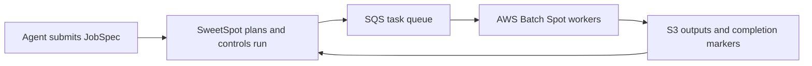
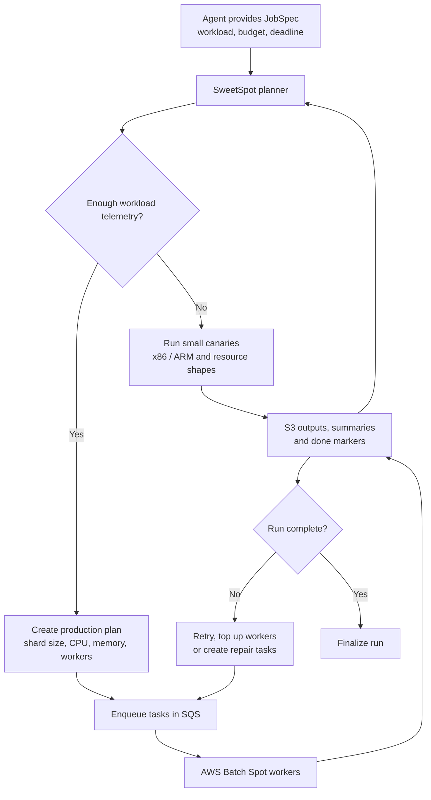

# SweetSpot

SweetSpot is a cost-aware AWS Batch Spot work runner for trusted, idempotent, embarrassingly parallel workloads. It packages a rock-solid reliability pattern for massive, retryable batch jobs using SQS and S3.

SweetSpot is an **at-least-once** runner, not an exactly-once transaction system. The SQS queue is a trusted control plane: anyone who can enqueue a task can choose the command executed by the worker task role. Commands must therefore be trusted and idempotent.


## Core design

```text
SQS task message
-> worker checks deterministic S3 done marker
-> if done exists: delete/ack message
-> else process task
-> upload output/summary
-> upload done marker last
-> only then delete/ack message
```

If a Spot host dies before ack, SQS visibility timeout returns the task. If a task repeatedly fails, SQS redrives it to the DLQ.

### Ideal workloads

- Batch inference / annotation
- Dataset conversion and CPU-heavy ETL
- Web scraping and simulation sweeps
- Self-play generation

### What it is not

- Not cloud agnostic
- Not a scheduler replacing AWS Batch
- Not exactly-once for arbitrary external side effects

Chess/Stockfish workflows live under `examples/`.

## Architecture





## Quickstart

### Dev installation

```bash
python -m venv .venv
. .venv/bin/activate
pip install --constraint requirements.lock -e '.[dev]'
ruff check . && mypy sweetspot && python -m unittest discover -s tests -v
```

For full release closeout (also runs OpenTofu checks when tofu is installed): `scripts/verify_release.sh`.

### Task schema (`sweetspot.task.v1`)

Each SQS message is a JSON object:

```json
{
  "schema": "sweetspot.task.v1",
  "run_id": "hello-001",
  "task_id": "task-000001",
  "command": ["python", "/app/hello_worker.py"],
  "timeout_seconds": 3600,
  "output_s3": "s3://my-bucket/runs/hello-001/shards/task-000001.txt",
  "summary_s3": "s3://my-bucket/runs/hello-001/summaries/task-000001.summary.json",
  "done_s3": "s3://my-bucket/runs/hello-001/done/task-000001.done.json"
}
```

The worker sets environment variables for the command (`SWEETSPOT_TASK_JSON`, `SWEETSPOT_TASK_ID`, `SWEETSPOT_RUN_ID`, `SWEETSPOT_OUTPUT_PATH`, `SWEETSPOT_METRICS_PATH`, `SWEETSPOT_TASK_HASH`, `SWEETSPOT_ATTEMPT_ID`, `SWEETSPOT_DONE_S3`). See `docs/reliability_contract.md` for the full protocol.

## CLI reference

The primary agent interface uses a high-level controller workflow. Lower-level operator utilities are grouped under `sweetspot admin ...`.

| Command | Purpose | Key flags |
| --- | --- | --- |
| `sweetspot plan` | Generate canary and production plans from a JobSpec. | `--input-manifest-jsonl`, `--out-canary-tasks-jsonl`, `--canary-summary-jsonl` |
| `sweetspot run` | Execute canaries, submit production workers, reconcile. | `--deployment`, `--apply`, `--reconcile-until-drained`, `--finalize` |
| `sweetspot status RUN_ID` | Summarize run artifacts and active Batch workers. | `--format table`, `--queue-url`, `--job-queue` |
| `sweetspot repair RUN_ID` | Build and optionally apply run-scoped repair plans. | `--task-status-jsonl`, `--apply` |
| `sweetspot cancel RUN_ID` | Safely cancel run-scoped Batch jobs (dry-run by default). | `--apply` |
| `sweetspot admin enqueue-jsonl` | Validate and submit tasks to SQS. | `--queue-url`, `--tasks-jsonl`, `--submit` |
| `sweetspot admin submit-workers` | Size and submit Batch workers (dry-run by default). | `--batch-job-queue`, `--job-definition`, `--submit` |
| `sweetspot admin supervise-workers` | Multi-loop bounded worker pool supervisor. | `--target-active-workers`, `--loops`, `--submit` |
| `sweetspot admin finalize` | Stream tasks, check done markers, write manifests. | `--upload`, `--publish-ready`, `--dry-run` |
| `sweetspot admin doctor` | Preflight AWS/SQS/S3/Batch/CloudWatch prerequisites. | `--queue-url`, `--job-queue`, `--s3-prefix` |
| `sweetspot admin scout` | Rank Spot pools by expected total cost (read-only). | `--preset mixed`, `--observed-summaries`, `--regions` |
| `sweetspot admin lane-manager` | Multi-region cost-aware lane allocation. | `--config lanes.json` |

> Always use `sweetspot admin scout --preset smallest` or `--preset mixed` before large runs to compare cheap x86 and ARM/Graviton lanes from canary telemetry. For 2 GiB medium instances, reserve less than the full host memory (for example 1536 MiB) so Batch/ECS can schedule the job. Do not steer users to `t3*`/`t4g*` small or micro lanes for managed AWS Batch: Batch rejects those burstable instance types before workers can run.

Config files (`--config` or `SWEETSPOT_CONFIG`) can pre-populate common flags. All mutating commands are dry-run by default.

## Infrastructure

`infra/opentofu/` creates:

- SQS work queue + DLQ (SSE enabled, by-source-queue redrive allow policy)
- AWS Batch Spot compute environment and queue
- Optional On-Demand repair queue
- Least-privilege IAM roles scoped to configured S3 prefixes
- No-ingress Batch security group, IMDSv2-required encrypted-root launch template
- CloudWatch dashboard and baseline alarms
- Optional monthly AWS Budget alerts

See `infra/opentofu/README.md` for details.

## Further reading

- `CONTRIBUTING.md` -- contributor workflow, trust boundary, release hygiene
- `SECURITY.md` -- trusted-workload threat model
- `docs/reliability_contract.md` -- full worker/done-marker protocol
- `docs/cost_model.md` -- expected-total-cost pool ranking formulas
- `docs/release_checklist.md` -- release/tag hygiene
- `CHANGELOG.md` -- unreleased changes

## License

Apache-2.0.
